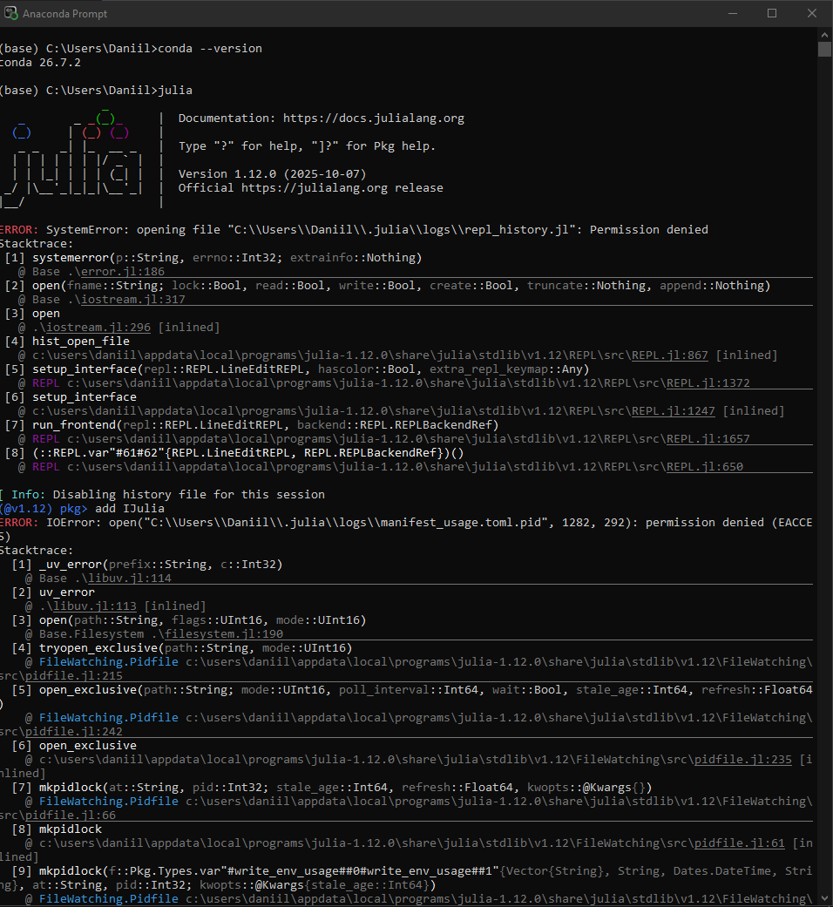
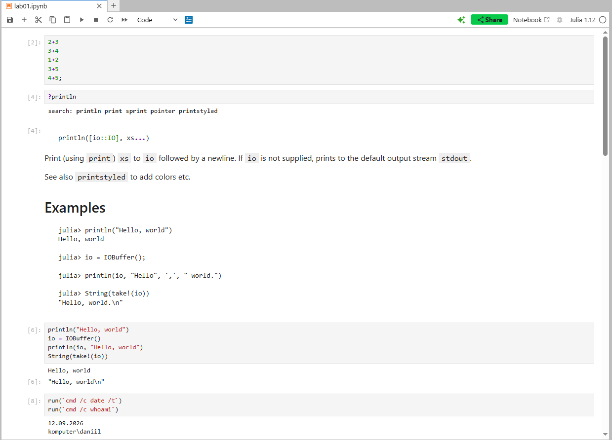
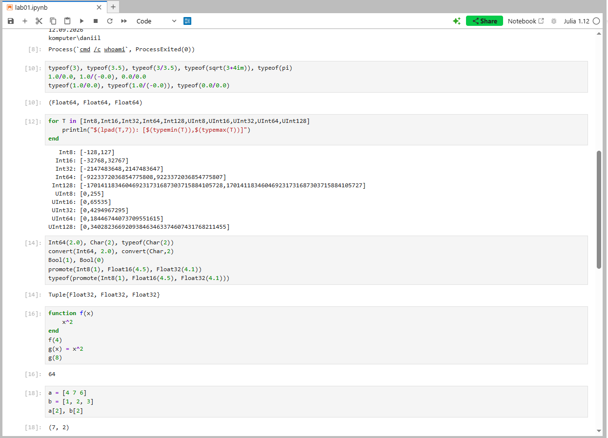
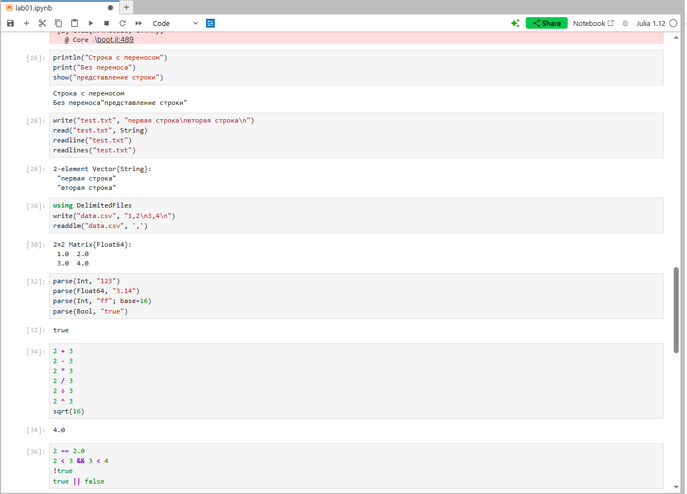

---
## Author
author:
  name: Седохин Даниил Алеквсеевич

## Title
title: "Лабораторная работа"
subtitle: "Номер 1"
license: "CC BY"
---

# Цель работы

Основная цель работы — подготовить рабочее пространство и инструментарий для
работы с языком программирования Julia, на простейших примерах познакомиться
с основами синтаксиса Julia.

# Выполнение лабораторной работы

В PowerShell от имени администратора устанавливали дополнительное ПО через менеджер пакетов Chocolatey. Выполнены команды choco install notepadplusplus -y и choco install far -y. Система скачала установщики, распаковала их и добавила ярлыки в систему.
Зачем: Это подготовительный этап (раздел 1.3.1). Notepad++ и Far Manager рекомендованы в методичке для удобной работы с кодом, но для самой лабы они не обязательны.
(рис. [-@fig-001]).

{#fig-001}

Запустили Julia в Anaconda Prompt командой julia.  Затем в пакетном режиме попытались выполнить add IJulia, и снова выскочила ошибка IOError: permission denied (EACCES).
Зачем: Это демонстрация возникшей проблемы (раздел 1.3.1). Папка .julia была создана с правами администратора при установке через Chocolatey, и обычный пользователь не мог в неё писать. Этот шаг в отчете показывает, с какой сложностью столкнулись и как её решали.
(рис. [-@fig-002]).

{#fig-002}

 После исправления прав на папку .julia повторили команду add IJulia в пакетном режиме Julia. Система скачала реестр General, установила зависимости (Conda, ZMQ, JSON, PrecompileTools и др.), собрала пакеты и зарегистрировала ядро.
Зачем: Это ключевой этап подготовки (раздел 1.3.1). Без пакета IJulia Jupyter не сможет запускать код на Julia.
(рис. [-@fig-003]).

{#fig-003}

Запустили Jupyter Lab командой jupyter lab  Создали новый ноутбук через File  New Notebook. В правом верхнем углу видно «No Kernel» — ядро пока не выбрано.
Зачем: Это начало практической части (раздел 1.3.2). Ноутбук — основной инструмент для выполнения всех последующих примеров.
(рис. [-@fig-004]).

{#fig-004}

Выполнили простейшие арифметические операции: 2+3, 3+4, 1+2, 3+5, 4+5;. Точка с запятой в конце подавляет вывод результата.

Вызвали встроенную справку командой ?println. Jupyter вывел описание функции, её синтаксис и примеры использования.

Продемонстрировали работу с буфером ввода-вывода: println("Hello, world") выводит в stdout, а io = IOBuffer(); println(io, ...); String(take!(io)) записывает строку в буфер и извлекает её.
Зачем: Это примеры из раздела 1.3.3. Они знакомят с базовым синтаксисом, справкой и работой с потоками ввода-вывода.
(рис. [-@fig-005]).

{#fig-005}

Выполнили системные команды через Julia:  — получили текущую дату и имя пользователя.

Определили типы числовых величин через typeof(): целые, с плавающей точкой, комплексные, иррациональные. Проверили деление на ноль и получили Inf, -Inf, NaN.

Вывели диапазоны всех целочисленных типов (Int8…UInt128) с помощью цикла for и функций typemin/typemax.

Продемонстрировали преобразование типов: Int64(2.0), Char(2), convert(), promote().

Объявили функции двумя способами: function f(x) ... end и короткую g(x) = x^2. Проверили их работу.
Зачем: Это примеры из раздела 1.3.3. Они показывают систему типов Julia, работу с циклами, преобразования и объявление функций.
(рис. [-@fig-006]).

{#fig-006}

Создали вектор-строку a = [4 7 6] и вектор-столбец b = [1, 2, 3]. Обратились ко вторым элементам: a[2], b[2].

Создали матрицу 2x2 Am = [a b; c d] и извлекли все её элементы по индексам.

Выполнили умножение вектор-строки на матрицу и на вектор-столбец с транспонированием: aa*AA*aa'. Получили скалярный
результат 27.
Зачем: Это примеры из раздела 1.3.3. Они демонстрируют работу с одномерными и двумерными массивами, индексацию и линейную алгебру.
(рис. [-@fig-007]).

{#fig-007}

Задание 1 (ввод/вывод): Изучили println, print, show, write, read, readline, readlines, readdlm. Показали разницу между выводом с переносом и без, загрузили CSV через DelimitedFiles.

Задание 2 (parse): Преобразовали строки в числа:

Задание 3 (математика): Выполнили сложение, вычитание, умножение, деление, целочисленное деление, возведение в степень, извлечение корня, сравнения и логические операции.

Задание 4 (матрицы): Сложили и вычли матрицы A и B, вычислили скалярное произведение dot(v, w), транспонировали A', умножили на скаляр 2A.
Зачем: Это обязательная часть лабораторной работы (раздел 1.3.4). Она закрепляет навыки работы с основными функциями и операциями Julia.
(рис. [-@fig-008]).

{#fig-008}

# Выводы

Я подготовил рабочее пространство и инструментарий для
работы с языком программирования Julia, на простейших примерах познакомиться
с основами синтаксиса Julia.
