---
## Author
author:
  name: Седохин Даниил Алексеевич
## Title
title: Лабораторная работа
subtitle: Номер 2
license: CC BY
date: today
date-format: "YYYY-MM-DD" # Example: 2025-09-06
---

# Информация

## Докладчик

:::::::::::::: {.columns align=center height=70%}
::: {.column width="70%" height=70%}

  * Седохин Даниил Алеквсеевич
  * Студент
  * Российский университет дружбы народов им. П. Лумумбы

:::
::: {.column width="30%" height=70%}

:::
::::::::::::::

## Цель работы

Изучить структуры данных, реализованные в языке Julia (кортежи, словари, множества, массивы), научиться применять их и операции над ними для решения практических задач.

# Выполнение лабораторной работы

## Слайд 1

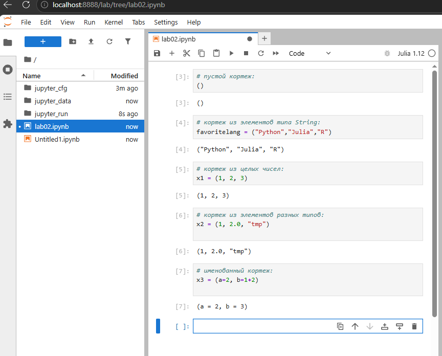{height=60%}

## Слайд 2

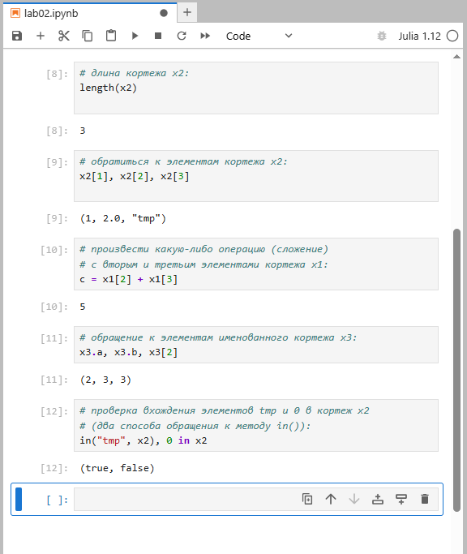{height=60%}

## Слайд 3

{height=60%}

## Слайд 4

{height=60%}

## Слайд 5

{height=60%}

## Слайд 6

{height=60%}

## Слайд 7

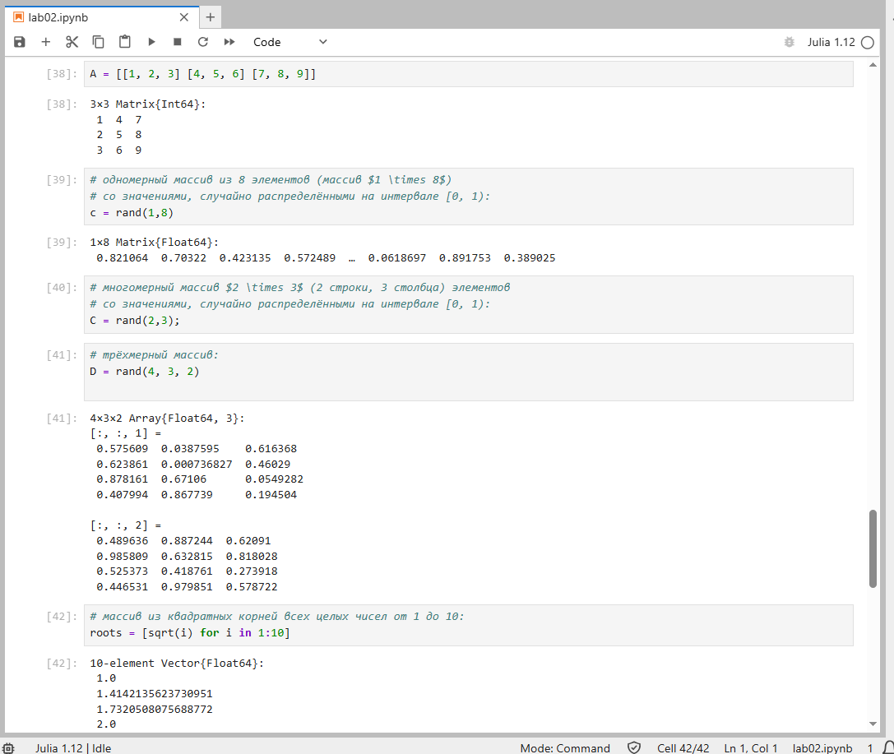{height=60%}

## Слайд 8

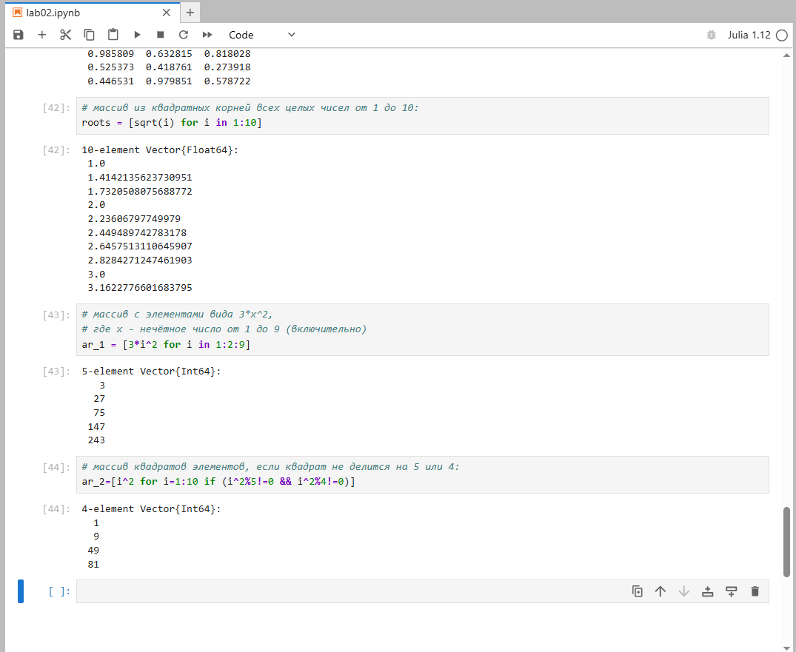{height=60%}

## Слайд 9

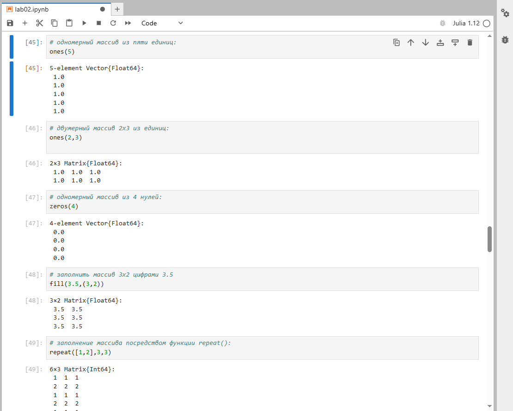{height=60%}

## Слайд 10

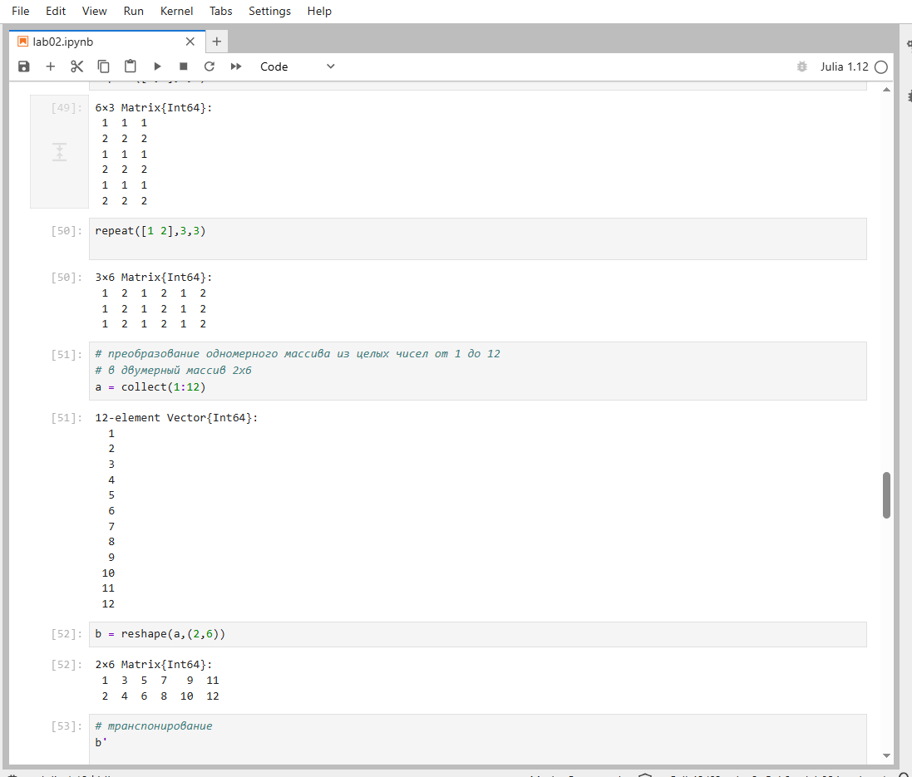{height=60%}

## Слайд 11

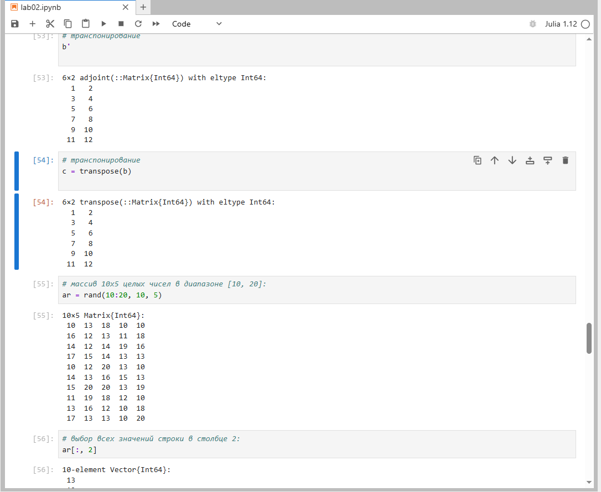{height=60%}

## Слайд 12

{height=60%}

## Слайд 13

{height=60%}

## Слайд 14

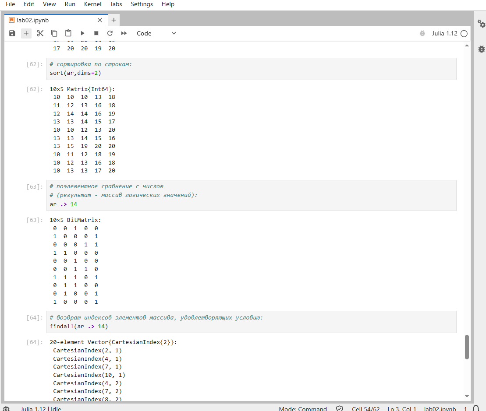{height=60%}

## Слайд 15

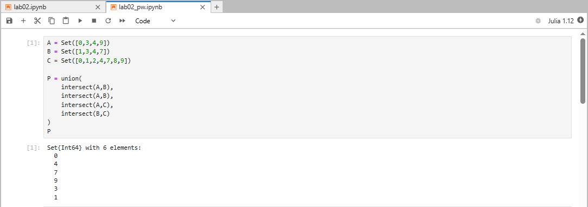{height=60%}

## Слайд 16

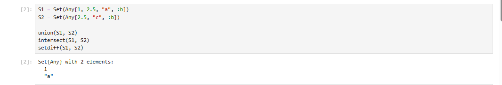{height=60%}

## Слайд 17

{height=60%}

## Слайд 18

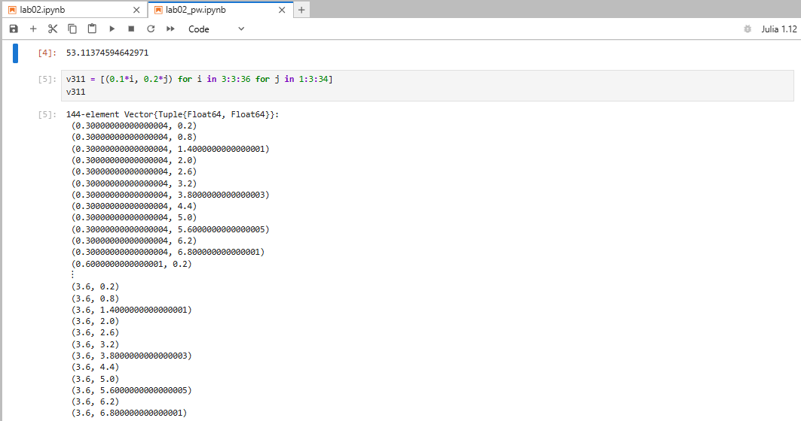{height=60%}

## Слайд 19

{height=60%}

## Слайд 20

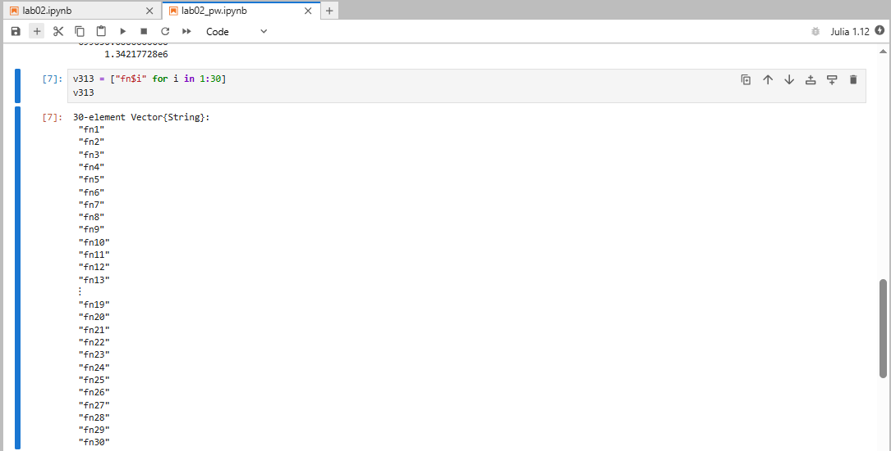{height=60%}

## Слайд 21

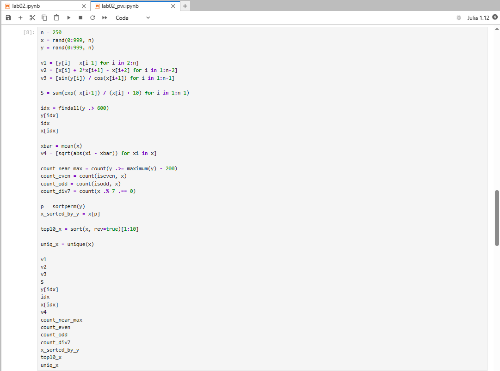{height=60%}

## Слайд 22

{height=60%}

## Слайд 23

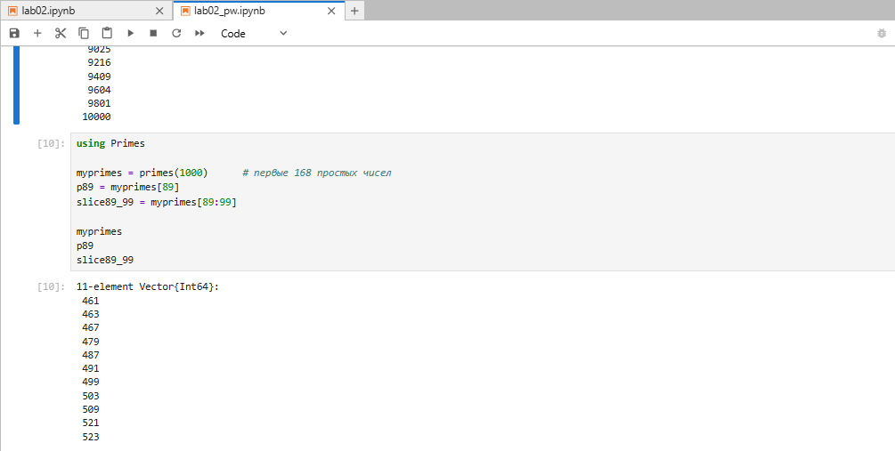{height=60%}

## Слайд 24

{height=60%}

## Выводы

В ходе лабораторной работы мы изучили кортежи, словари, множества и массивы в языке Julia. Освоили операции над ними: индексацию, добавление и удаление элементов, объединение, пересечение, разность, сортировку, срезы и генерацию массивов. Применили эти структуры для работы с числовыми последовательностями, случайными данными и внешним пакетом Primes.
