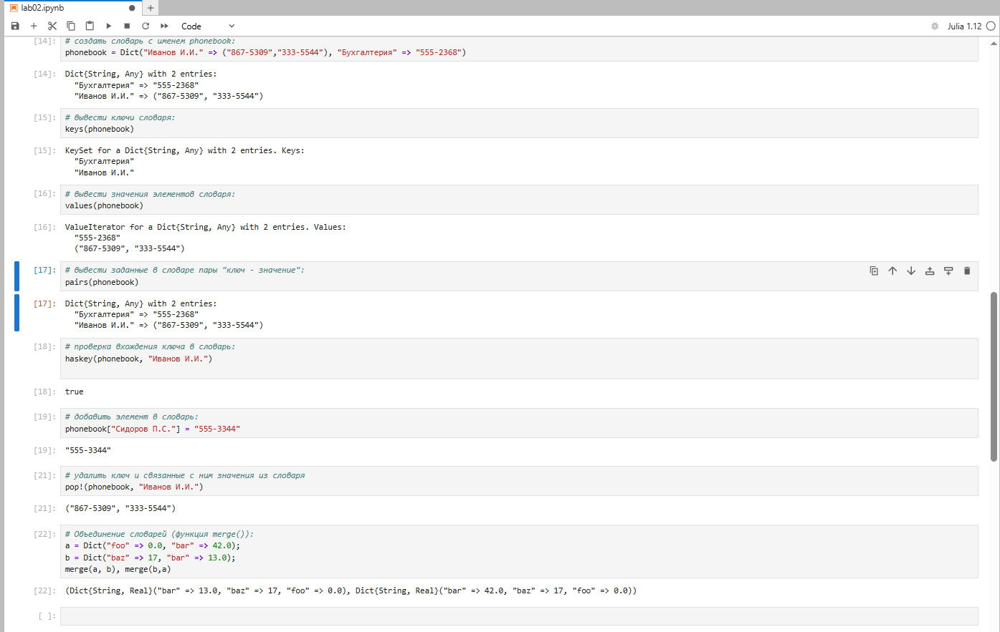
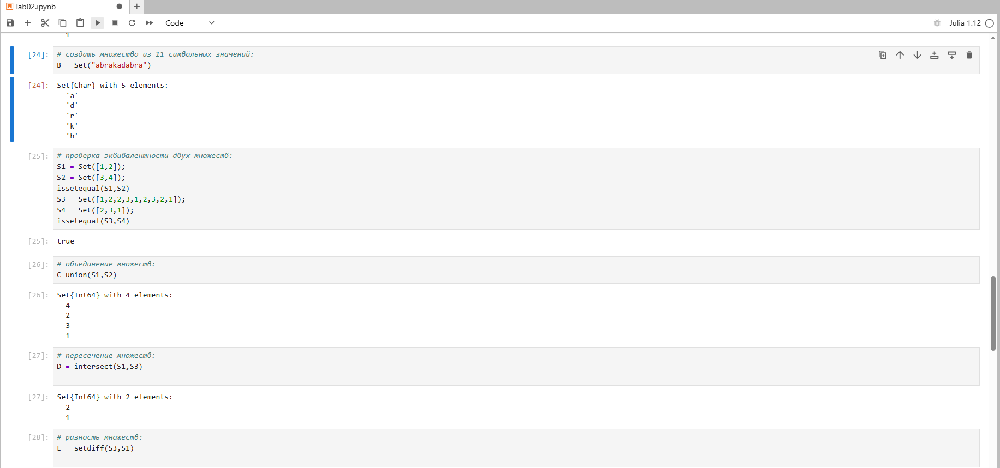
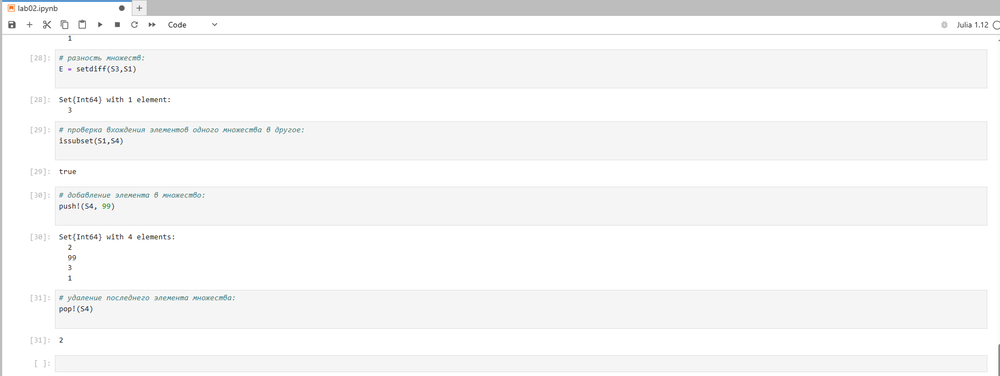
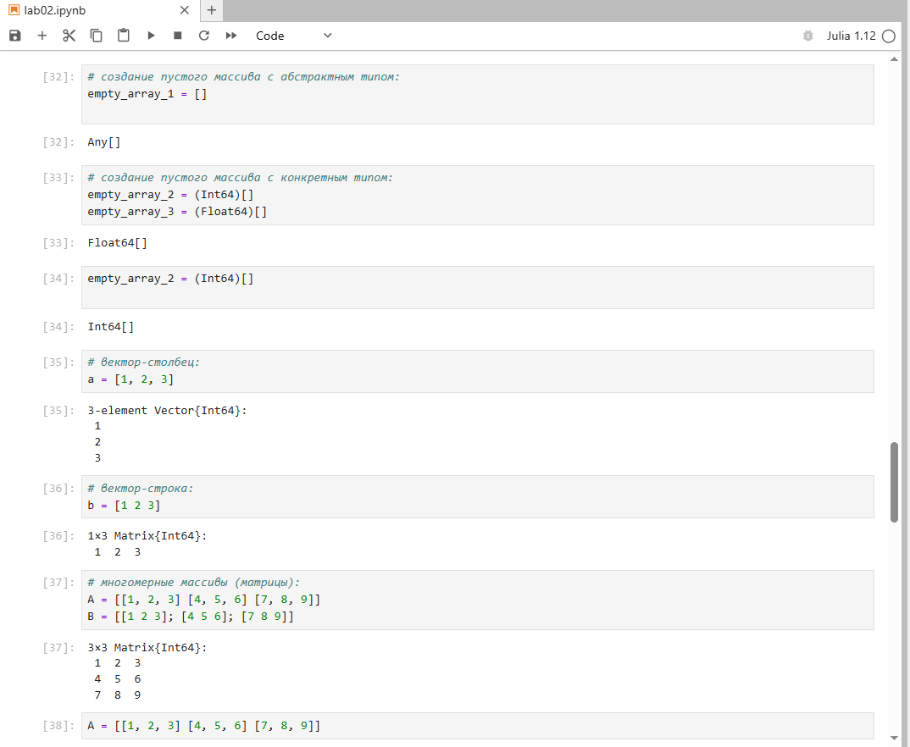
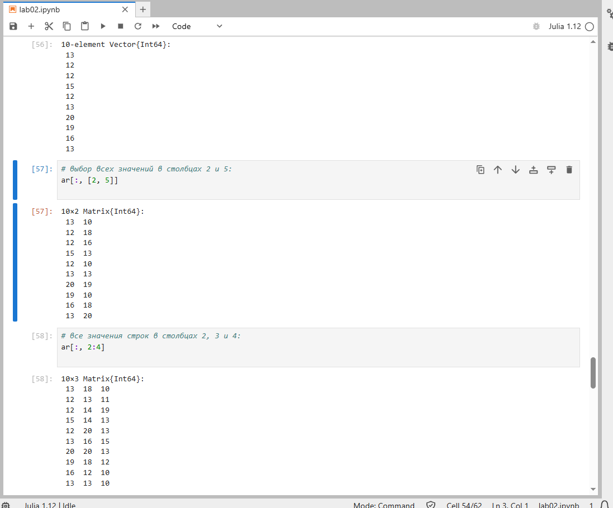
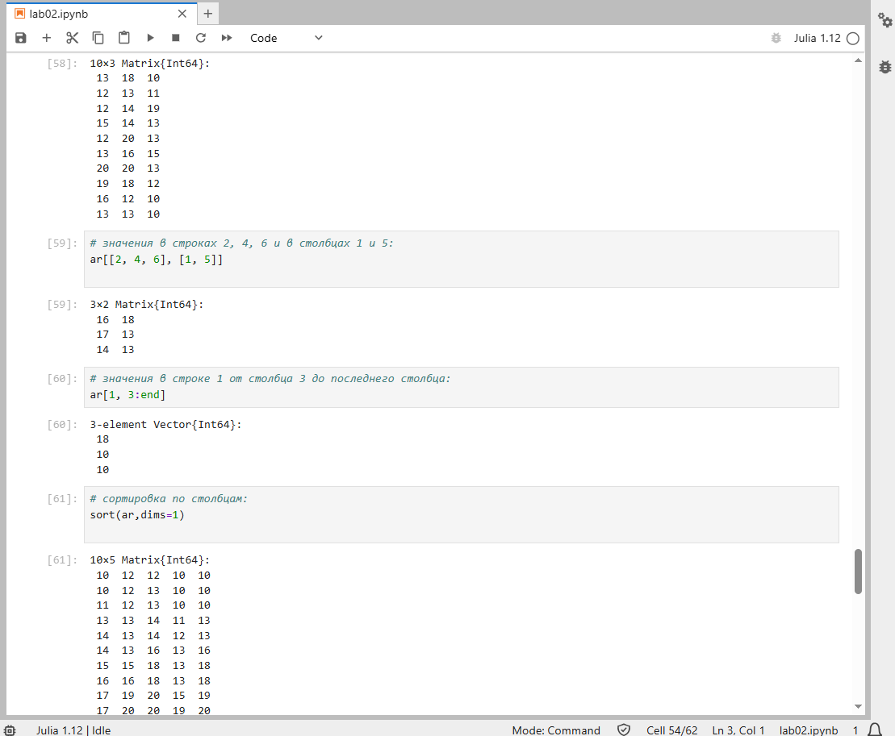
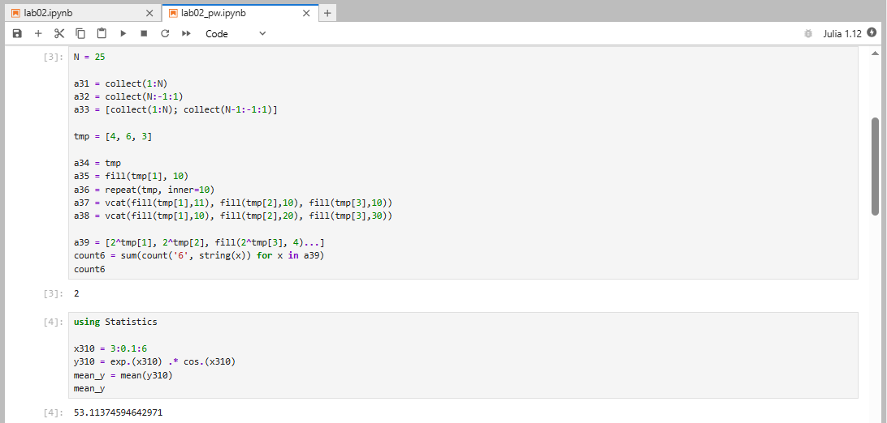
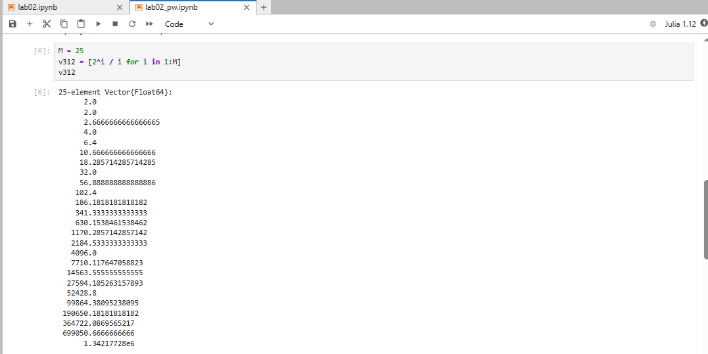
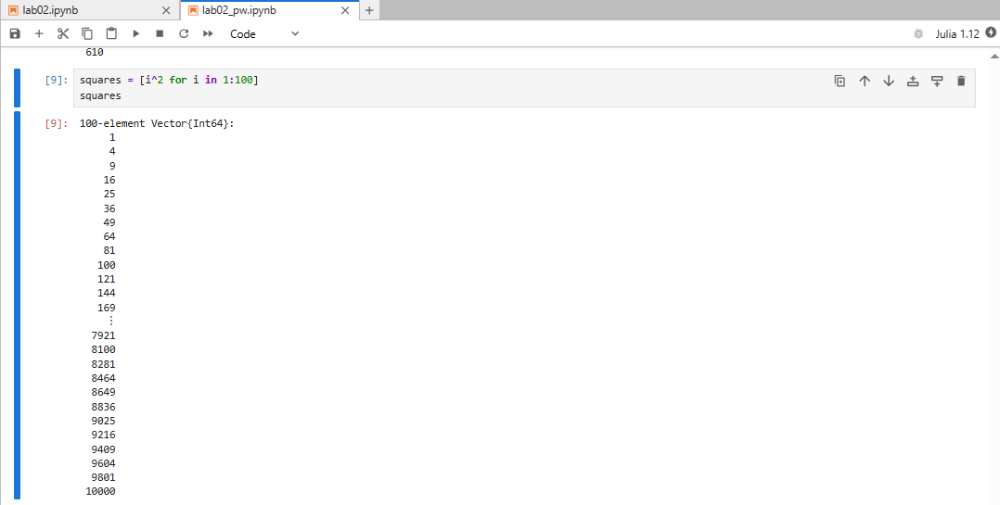
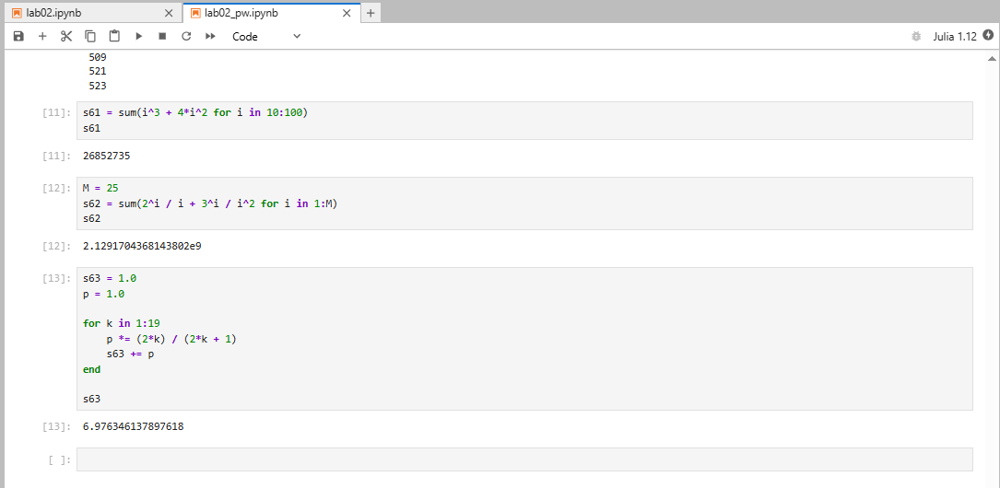

---
## Author
author:
  name: Седохин Даниил Алеквсеевич

## Title
title: "Лабораторная работа"
subtitle: "Номер 2"
license: "CC BY"
---

# Цель работы

Изучить структуры данных, реализованные в языке Julia (кортежи, словари, множества, массивы), научиться применять их и операции над ними для решения практических задач.

# Выполнение лабораторной работы

В этом примере мы знакомимся с кортежами. Создаём пустой кортеж, кортеж из строк, кортеж из целых чисел, кортеж с элементами разных типов и именованный кортеж с полями a и b.
(рис. [-@fig-001]).

{#fig-001}

Продолжаем работу с кортежами: определяем длину кортежа, обращаемся к его элементам по индексу, складываем два элемента, обращаемся к полям именованного кортежа и проверяем вхождение значений в кортеж двумя способами.
(рис. [-@fig-002]).

{#fig-002}

Создаём словарь с телефонными номерами сотрудников и учимся просматривать его содержимое: отдельно выводим ключи, отдельно значения, отдельно пары «ключ — значение», и проверяем наличие конкретного ключа в словаре.
(рис. [-@fig-003]).

{#fig-003}

Учимся изменять словарь: добавляем новую запись, удаляем существующую через функцию pop, смотрим, что она возвращает. Затем объединяем два словаря в разном порядке и наблюдаем, какое значение остаётся при совпадении ключей.
(рис. [-@fig-004]).

{#fig-004}

Знакомимся с множествами. Создаём множество из символов строки и два числовых множества. Проверяем, эквивалентны ли разные множества, в том числе когда одно из них записано с повторяющимися элементами.
(рис. [-@fig-005]).

{#fig-005}

Выполняем основные операции над множествами: объединение, пересечение и разность. Отдельно проверяем, является ли одно множество подмножеством другого.
(рис. [-@fig-006]).

{#fig-006}

Добавляем элемент в множество и удаляем последний элемент. Видим, что множество хранит только уникальные значения.
(рис. [-@fig-007]).

{#fig-007}

Переходим к массивам. Создаём пустые массивы с абстрактным и конкретным типом элементов, вектор-столбец, вектор-строку и две квадратные матрицы, записанные разными способами.
(рис. [-@fig-008]).

{#fig-008}

Создаём трёхмерный массив случайных чисел и осваиваем генераторы массивов: формируем вектор квадратных корней чисел от 1 до 10 и вектор, зависящий от нечётных чисел.
(рис. [-@fig-009]).

{#fig-009}

Создаём массив квадратов чисел, которые не делятся одновременно на 5 и на 4. Показываем, что внутри генератора можно задавать условие отбора.
(рис. [-@fig-010]).

{#fig-010}

Знакомимся со стандартными функциями создания массивов: массив из единиц, массив из нулей, заполнение матрицы одним и тем же значением и повторение набора значений по строкам и столбцам.
(рис. [-@fig-011]).

{#fig-011}

Преобразуем одномерный массив из 12 чисел в матрицу 2 на 6 и получаем её транспонированную версию двумя способами.
(рис. [-@fig-012]).

{#fig-012}

Создаём матрицу случайных чисел и учимся выбирать из неё отдельные столбцы: один столбец, набор нескольких столбцов и диапазон столбцов.
(рис. [-@fig-013]).

{#fig-013}

Сортируем матрицу по столбцам и по строкам. Сравниваем каждый элемент с числом, получаем матрицу логических значений и находим индексы подходящих элементов.
(рис. [-@fig-014]).

{#fig-014}

По трём множествам A, B, C нашли объединение попарных пересечений. В результате получили множество из шести элементов.
(рис. [-@fig-015]).

{#fig-015}

Создали
два множества с элементами разных типов и применили объединение, пересечение и разность.
(рис. [-@fig-016]).

{#fig-016}

Создали массивы разными способами: от 1 до N, обратный, «пила», массив tmp, массивы с повторениями и массив степеней двойки с повтором последнего значения. Посчитали количество цифр 6 — получилось 2 раза. Затем создали вектор значений y = e в степени x, умноженной на косинус x, и нашли его среднее значение.
(рис. [-@fig-017]).

{#fig-017}

Создали вектор кортежей из двух чисел с шагами 0.3 и 0.6. Получился вектор из 144 элементов.
(рис. [-@fig-018]).

{#fig-018}

Создали вектор из 25 элементов вида два в степени i, делённое на i.
(рис. [-@fig-019]).

{#fig-019}

Создали вектор из 30 строк fn1...fn30 с помощью интерполяции строк.
(рис. [-@fig-020]).

{#fig-020}

Сгенерировали два вектора x и y длины 250 со случайными числами. Сформировали производные векторы, вычислили сумму, нашли элементы y больше 600 и соответствующие им значения x, посчитали статистику, отсортировали, получили топ-10 и уникальные значения.
(рис. [-@fig-021]).

{#fig-021}

Создали массив квадратов всех целых чисел от 1 до 100.
(рис. [-@fig-022]).

{#fig-022}

Подключили пакет Primes. Сгенерировали массив первых 168 простых чисел, нашли 89-е простое число (461) и сделали срез с 89-го по 99-й элемент включительно.
(рис. [-@fig-023]).

{#fig-023}

Вычислили три суммы: сумму кубов и утроенных квадратов от 10 до 100, сумму дробей со степенями двойки и тройки, а также сумму ряда, в котором каждое следующее слагаемое получается умножением предыдущего на дробь с растущими числителем и знаменателем.
(рис. [-@fig-024]).

{#fig-024}

# Выводы

В ходе лабораторной работы мы изучили кортежи, словари, множества и массивы в языке Julia. Освоили операции над ними: индексацию, добавление и удаление элементов, объединение, пересечение, разность, сортировку, срезы и генерацию массивов. Применили эти структуры для работы с числовыми последовательностями, случайными данными и внешним пакетом Primes.
